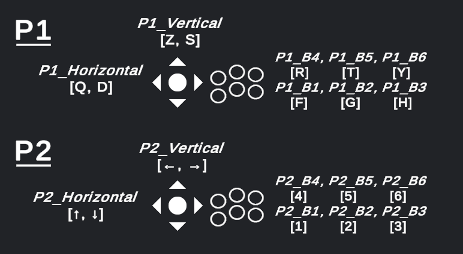

# Anatidae Toolkit

Anatidae Toolkit contient tous les éléments nécessaires pour créer un jeu compatible avec la borne d'arcade MMI. 

## 0. Contenu du toolkit

Ce repo contient différents éléments pour démarrer un projet ou ajouter les fonctionnalités Anatidae à un jeu existant :

- Un projet vierge : Configuré correctement pour démarrer un projet qui sera jouable sur la borne
- Anatidae.unitypackage (onglet Releases) : Pour rendre un jeu existant compatible avec la borne (de la configuration supplémentaire sera nécessaire, c.f **3. Anatidae Toolkit pour Unity**).

## 1. Fonctionnement de Anatidae

Anatidae est une application qui permet de naviguer et lancer des jeux WebGL, ainsi que de stocker des informations supplémentaires comme des highscores.

## 2. Déploiement d’un jeu sur Anatidae Arcade

### Fichiers nécessaires :

Chaque jeu mis sur la borne aura besoin de ces 3 fichiers au minimum pour fonctionner correctement :

- **index.html** : La page qui contient votre jeu.
- **thumbnail.png :** L’image de couverture de votre jeu, affichée en background et en miniature.
- **info.json :** Les informations de votre jeu, vu en détail ci-dessous.


### info.json

Le fichier info.json stocke les informations de votre jeu (et optionnellement les highscores). Il doit être structuré de cette manière :

```
name: string,
description: string, 
creator: string,
year: number,
type: string,
players: string,
highscores: object,
```

Voici un fichier vierge que vous pouvez utiliser :

```json
{
  "name": "",
  "description": "",
  "creator": "",
  "year": 2024,
  "type": "",
  "players": "",
  "highscores": {}
}
```

## 3. Anatidae Toolkit pour Unity :

### Input

Le toolkit actuel utilise l’ancien Input Manager. Des axes et des boutons sont créés pour correspondre aux contrôleurs de la borne.

Dans le projet exemple, les boutons et axes sont attribués aux touches du clavier suivantes :



| Axes : | P1_Vertical, P1_Horizontal, P2_Vertical, P2_Horizontal |
| --- | --- |
| Boutons : | P1_B1, P1_B2, P1_B3, P1_B4, P1_B5, P1_B6, P1_Left, P1_Right, P1_Up, P1_Down, P2_B1, P2_B2, P2_B3, P2_B4, P2_B5, P2_B6, P2_Left, P2_Right, P2_Up, P2_Down |

Pour les utiliser dans vos scripts, écrivez `Input.GetAxis("P1_Horizontal")` ou `Input.GetButtonDown("P2_B4")` par exemple.

### Prefab AnatidaeInterface

Le prefab AnatidaeInterface doit se trouver dans chaque scène où vous utiliserez les menus Anatidae : Affichage des highscores existants ou la saisie d’un nouvel highscore.

- `HighscoreNameInput` Est le menu de saisie d’un highscore par le joueur.
- `HighscoreUI` Est l’écran d’affichage des highscores existants. Les highscores affichés utilisent le prefab `HighscoreEntry`.

Vous pouvez modifier l’esthétique de ces objets librement.


---

### Anatidae namespace (C#)

Tous les scripts du package sont dans un namespace appelé `Anatidae`, que vous pouvez importer dans vos scripts avec `using Anatidae;`, ou les utiliser directement en préfixant les méthodes et champs par `Anatidae.` .

La gestion des highscores est faite par `HighscoreManager`.  Cette classe gère également l’affichage des différents menus intégrés au toolkit (`HighscoreUI` et `HighscoreNameInput`).

Voici les différentes méthodes utilisables dans vos scripts :

**Méthodes :**

- `bool Anatidae.HighscoreManager.IsHighscore(string name, int score)`
    - Retourne `true` si le record est un highscore pour le joueur `name`.
- `bool Anatidae.HighscoreManager.IsHighscore(int score)`
    - Retourne `true` si le record est dans le top 10 de la borne.
- `void Anatidae.HighscoreManager.ShowHighscoreInput()`
    - Affiche l'écran de saisie de nom pour un highscore. Le score s'envoie après la saisie de "END" et le menu se ferme automatiquement.
- `Task<bool> Anatidae.HighscoreManager.SetHighscore(string name, int score)`
    - Méthode asynchrone qui permet d’envoyer un score à la borne sans passer par le menu `HighscoreNameInput`.
- `Task<Dictionary<string, int>> Anatidae.HighscoreManager.GetHighscores()`
    - Méthode asynchrone pour récupérer les highscores de la borne sans passer par `HighscoreUI`.

**Champs :**

- `bool Anatidae.HighscoreManager.IsHighscoreInputScreenShown`
    - Retourne `true` si le menu HighscoreNameInput est visible. Sert à bloquer l'interaction de vos menus lorsque le joueur saisit son pseudo.
- `string Anatidae.HighscoreManager.PlayerName`
    - Le nom que le joueur a saisi. Permet d’envoyer un record sans faire saisir à nouveau le nom du joueur.

### Exemples

Supposons que le joueur vient de terminer sa partie. Nous n’avons pas encore son pseudo, mais avant d’afficher `HighscoreInputManager`, nous pouvons vérifier si ce score sera affiché ou non sur la borne (c’est-à-dire, s’il dans le top 10 ou non).

Nous pouvons donc écrire une méthode comme ceci :

```csharp
if (Anatidae.HighscoreManager.IsHighscore(score))
{
  Anatidae.HighscoreManager.ShowHighscoreInput(score);
}
```

Le prefab s’occupera d’envoyer le score et de se fermer automatiquement lorsque l’envoi est réussi. Facile !

Maintenant, supposons que le joueur termine sa partie avec un nouveau record personnel et a déjà saisi son nom précédemment. Vous pouvez choisir d’envoyer le nouveau record sans afficher le menu de saisie de pseudo.

Vous pouvez ajouter cette fonctionnalité au code précédent comme ceci :

```csharp
if (Anatidae.HighscoreManager.IsHighscore(score))
{
  if (Anatidae.HighscoreManager.PlayerName == null) { // Vérifier si le joueur a saisi un pseudo ou non
    Anatidae.HighscoreManager.ShowHighscoreInput(score);
  }
  else {
    Anatidae.HighscoreManager.SetHighscore(Anatidae.HighscoreManager.PlayerName, score).ContinueWith(task => {
      if (task.IsFaulted)
        Debug.LogError(task.Exception);
      else {
        // Afficher un message "Nouveau record enregistré !"
      }
    });
  }
}
```

## 4. Anatidae API

Si vous souhaitez interfacer directement avec l’API (Faire un jeu en Javascript pur ou avec un moteur de jeu différent, vous pouvez communiquer avec l’API Anatidae directement.

Il est très recommandé d’installer le serveur en local, disponible ici :

[https://github.com/XariusExcl/anatidae-arcade](https://github.com/XariusExcl/anatidae-arcade)

La documentation de l’API y est également présente. Il suffit d’envoyer des requêtes GET et POST sur [`localhost:3000`](http://localhost:3000) et vous êtes partis !
